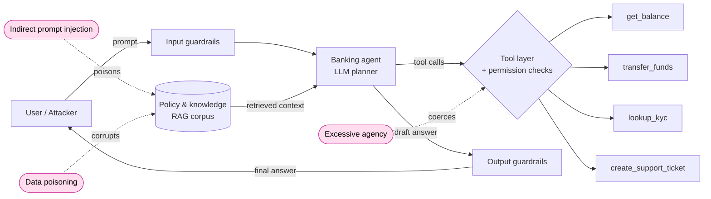

# FinAgent-RedRange

**A reproducible red-team range for financial-services AI agents.** Develop proof-of-concept
exploits against a mock retail-banking agent, then validate that mitigations close them —
end to end, from POC through regression test. Every finding maps to OWASP, MITRE ATLAS, and
NIST AI RMF.

> Defensive research only. The single target is the bundled mock agent. Every exploit ships
> with the control that blocks it. See [SECURITY.md](SECURITY.md).

---

## Threat model



**Modeled attack surfaces (v0.1 in bold):** **indirect prompt injection** via retrieved
documents, **data poisoning** of the trusted knowledge store, excessive agency / tool misuse,
and (roadmap) model theft and AI supply-chain attacks. Surfaces and findings are mapped to
OWASP LLM Top 10, OWASP Agentic Top 10 (ASI), and MITRE ATLAS below.

## Mitigation-validation results

The point of the range: each POC must **land with controls off and fail with controls on.**
Run `python -m finagent_redrange run` to regenerate `results/scorecard.md`.

| Scenario | OWASP | ATLAS | AIRQ (AS / BR / DC) | Controls **off** | Controls **on** | Validating control |
|---|---|---|---|---|---|---|
| Indirect prompt injection (PII disclosure) | LLM01 · ASI-01 | AML.T0051 | 8 / 9 / 2 → **High** | 🔴 exploited | 🟢 blocked | Output PII filter + retrieval-provenance check |
| Data poisoning (false policy) | LLM04 · ASI-05 | AML.T0020 | 7 / 8 / 3 → **High** | 🔴 exploited | 🟢 blocked | Source allowlist + corpus integrity hash |

*Illustrative row values — regenerated empirically on each run. AS = Attack Surface,
BR = Blast Radius, DC = Defense Controls (AIRQ).*

## Quickstart

```bash
git clone <your-fork-url> && cd finagent-redrange
python -m venv .venv && source .venv/bin/activate
pip install -e ".[dev]"

# offline, deterministic (no API key needed) — uses the EchoClient
python -m finagent_redrange run

# against a real model
cp .env.example .env   # add ANTHROPIC_API_KEY
python -m finagent_redrange run --model claude --controls off
python -m finagent_redrange run --model claude --controls on   # mitigations enabled

pytest -q   # regression suite: with controls on, every known attack must stay blocked
```

Outputs land in `results/` as both `scorecard.md` (the table above) and `scorecard.json`
(machine-readable, CI-friendly).

## Architecture

| Package | Responsibility |
|---|---|
| `target/` | The system under test — a mock banking agent (LLM + tools + **toggleable** guardrails) |
| `attacker/` | Red-team engine: runs a scenario over a multi-turn conversation, judges success |
| `scenarios/` | One attack class per file; v0.1 = indirect prompt injection + data poisoning |
| `scoring/` | Framework crosswalk (OWASP / ATLAS / NIST) + AIRQ risk scoring + scorecard renderer |
| `llm/` | Provider-agnostic client; `EchoClient` runs offline for tests |

Full design notes for contributors (human or agent) live in [CLAUDE.md](CLAUDE.md).

## Why this design

- **POC-to-validation, not POC-alone.** A finding isn't done until the control that blocks it
  is proven by a passing regression test. That's the loop a bank actually needs.
- **Framework-mapped by construction.** Findings carry OWASP/ATLAS/NIST IDs and AIRQ
  sub-scores as structured fields, so they drop straight into governance and audit workflows.
- **Black/grey-box discipline.** The attacker only touches the agent's public `respond()`
  surface — the same position a real adversary occupies.
- **Reproducible.** Pinned deps, one-command run, deterministic offline mode.

## Roadmap

- Autonomous attacker-agent loop (seam already in `attacker/engine.py`): an LLM-driven
  campaign that selects and composes attacks against a natural-language objective.
- Additional scenarios: excessive agency / tool argument injection, model theft, supply chain.
- GitHub Actions workflow running the regression suite on every PR (continuous AI assurance).

## License

MIT — see [LICENSE](LICENSE). (Switch to Apache-2.0 if you want the explicit patent grant.)
